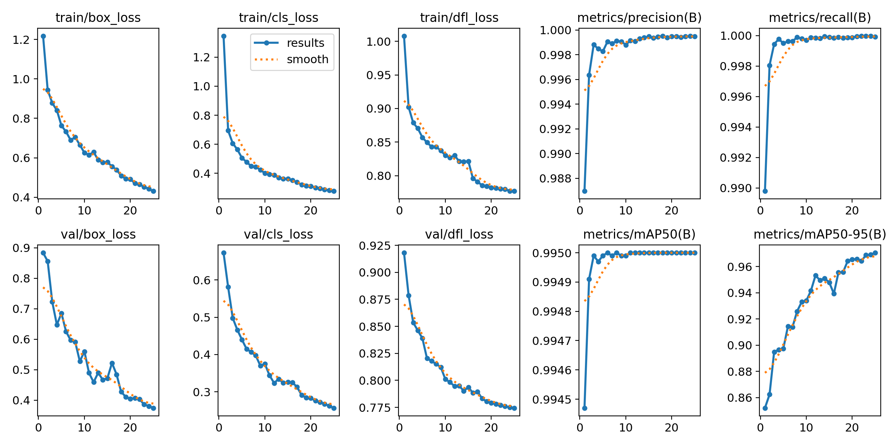
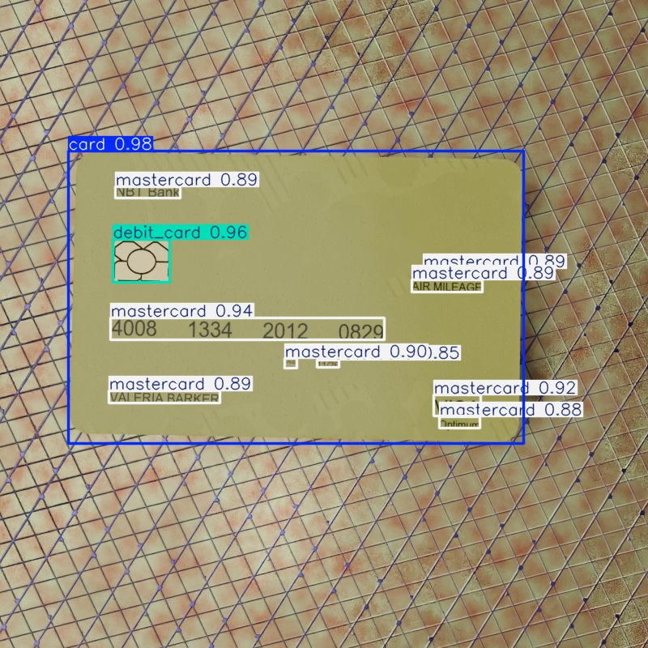
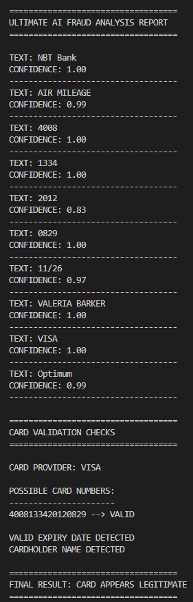

# CardShield-AI

CardShield-AI is an AI-powered credit/debit card fraud analysis system built using YOLOv8, OCR, and Python.

## Features

- Credit/Debit card detection using YOLOv8
- OCR text extraction using EasyOCR
- VISA and Mastercard identification
- Card number reconstruction
- Luhn Algorithm validation
- Expiry date verification
- Cardholder name detection
- Fraud analysis reporting

## Technologies Used

- Python
- YOLOv8
- OpenCV
- EasyOCR
- PyTorch
- Ultralytics

## Dataset

Synthetic Credit Card Detection Dataset from Hugging Face.

## Project Workflow

1. Train YOLOv8 model
2. Detect cards from images
3. Extract card text using OCR
4. Validate card number using Luhn Algorithm
5. Analyze fraud indicators
6. Generate final fraud analysis report

## Results

- High precision card detection
- OCR-based text extraction
- Automated fraud validation pipeline

## Project Structure

CardShield-AI/
│
├── dataset/
├── runs/
├── screenshots/
├── ultimate_fraud_detector.py
├── train.py
├── predict.py
├── luhn_validator.py
├── ocr_test.py
├── requirements.txt
└── README.md

## Training Results

## Detection Output

## Fraud Analysis

# Author

Shahriyar Rahman Simoon

Computer Science & Engineering Student

AI & Cybersecurity Enthusiast
